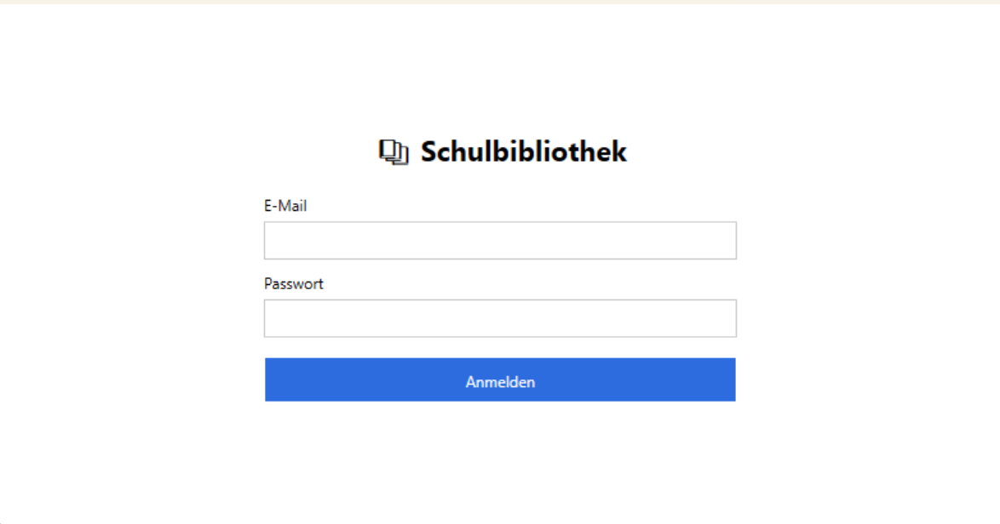
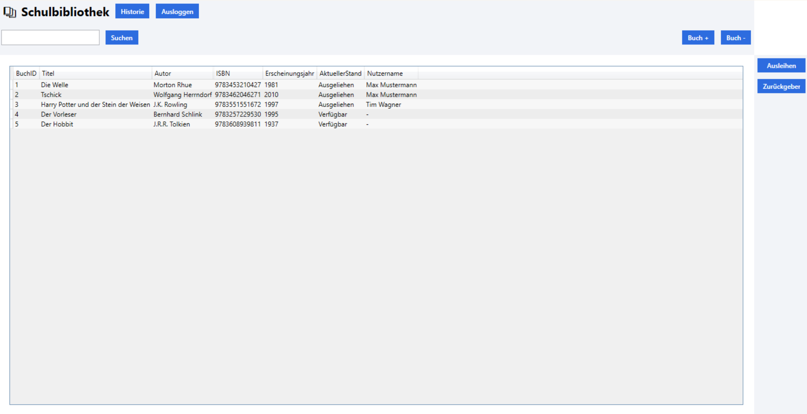
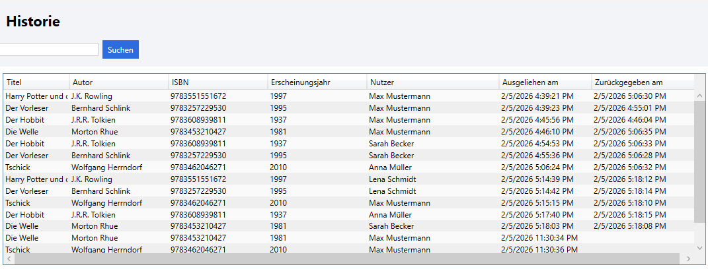
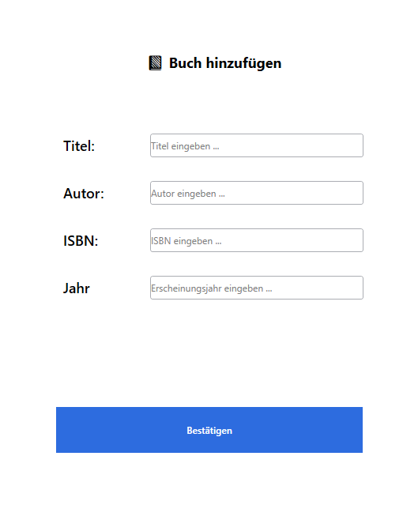
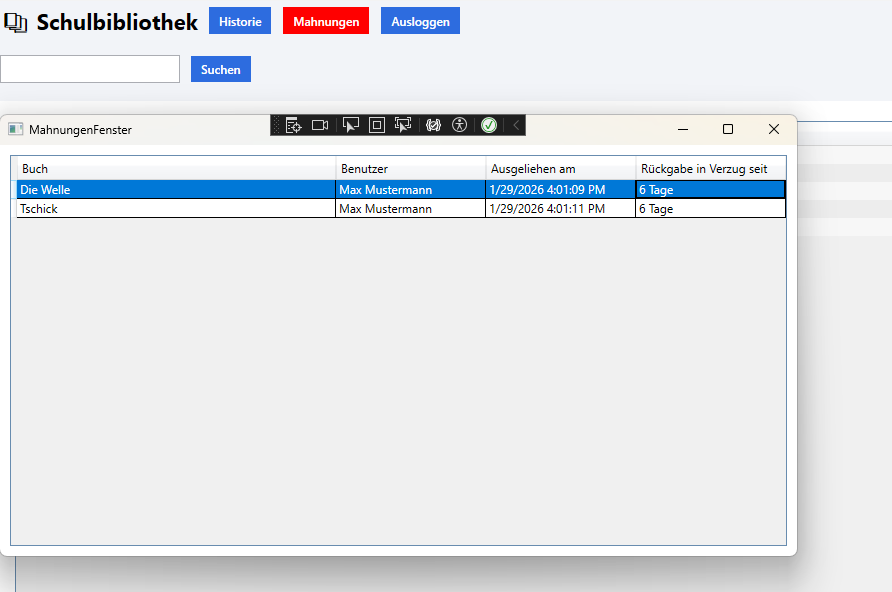

# Schulbibliothek – Ausleihsystem

**Name:** Ahmet Aktas  

---

# 📚 Projektbeschreibung

Dieses Projekt ist ein **Ausleihsystem für eine Schulbibliothek**.

Schüler und Lehrer können Bücher suchen, ausleihen und zurückgeben.  
Bibliothekare haben erweiterte Rechte und können den Buchbestand verwalten
sowie überfällige Ausleihen (Mahnungen) einsehen.

Das Programm wurde als **WPF-Anwendung** mit einer **SQLite-Datenbank**
entwickelt und nutzt **Entity Framework Core** zur Datenverwaltung.

---

## 🖥️ Nutzung des Programms

### 1️⃣ Anmeldung

Nach dem Start des Programms erscheint ein **Anmeldefenster**.  
Der Benutzer meldet sich mit **E-Mail-Adresse und Passwort** an.

- Bei falschen Zugangsdaten erscheint eine Fehlermeldung  
- Bei erfolgreicher Anmeldung öffnet sich das Hauptfenster  

📸 **Screenshot: Login-Fenster**  

---

### 2️⃣ Hauptfenster – Bücherverwaltung

Im Hauptfenster werden alle Bücher in einer **Tabelle (DataGrid)** angezeigt.

**Mögliche Funktionen:**
- Bücher suchen (nach Titel oder ISBN)
- Bücher ausleihen und zurückgeben
- Eigene Ausleihhistorie anzeigen
- (Bibliothekar) Bücher hinzufügen und löschen
- (Bibliothekar) Mahnungen einsehen

📸 **Screenshot: Hauptfenster – Schüler / Lehrer**  
.png)

📸 **Screenshot: Hauptfenster – Bibliothekar**  

---

### 3️⃣ Historie & Mahnungen

- **Schüler und Lehrer** sehen nur ihre **eigene Ausleihhistorie**
- **Bibliothekare** sehen die Historie **aller Benutzer**
- Überfällige Bücher werden automatisch erkannt
- Überfällige Ausleihen erscheinen im **Mahnungsfenster**

📸 **Screenshot: Historie-Fenster**  

---
### 4️⃣ Buch hinzufügen (Bibliothekar)

Bibliothekare können über das Hauptfenster neue Bücher zum Bestand hinzufügen.

Öffnen des **Buch-hinzufügen-Fensters** über den Button **„Buch +“**

Eingabe von:

Titel

Autor

ISBN

Erscheinungsjahr

Nach Bestätigung wird das Buch in der Datenbank gespeichert

Die Buchliste im Hauptfenster wird automatisch aktualisiert

📸 **Screenshot: Buch hinzufügen**

### 5️⃣ Mahnungen (Bibliothekar)

Überfällige Ausleihen werden automatisch erkannt und im **Mahnungsfenster**
angezeigt.

Ein Buch gilt als **überfällig**, wenn die Leihfrist überschritten ist

Die Anzahl der Tage im Verzug wird berechnet und angezeigt

Das Mahnungsfenster listet:

Buch

Benutzer

Ausleihdatum

Tage im Verzug

🔔 **Visuelle Hervorhebung**

Existieren Mahnungen, erscheint der **„Mahnungen“-Button**

Der Button ist rot und besitzt einen **Blink-Effekt**

Gibt es keine Mahnungen, ist der Button **nicht sichtbar**

📸 **Screenshot: Mahnungen-Fenster**

## 🎥 Screencast (Video)

Ein Screencast zur Demonstration der Programmnutzung befindet sich im Ordner  
**Dokumentation** und ist in der README verlinkt.

➡️ **[Screencast herunterladen](Dokumentation/screencast.mp4)**

**Inhalt des Videos:**
- Anmeldung
- Bücher suchen
- Buch ausleihen und zurückgeben
- Historie und Mahnungen anzeigen

---

## 🛠️ Technische Details

- Programmiersprache: **C#**
- Framework: **WPF (.NET 7)**
- Datenbank: **SQLite**
- ORM: **Entity Framework Core**
- Architektur: **MVVM-Grundstruktur**
- Versionsverwaltung: **Git / GitHub**

---

## 🔁 Abweichungen vom Papierprototyp

Während der Implementierung kam es zu Abweichungen vom ursprünglichen
Papierprototyp.

Im Papierprototyp war vorgesehen, einzelne Informationen (z. B. Buchdetails
oder Ausleihen) in separaten Fenstern darzustellen.  
Im finalen Programm wurde stattdessen ein **DataGrid** verwendet, um Bücher,
Ausleihen und Historien **übersichtlich in Tabellenform** anzuzeigen.

**Begründung der Abweichung:**
- Bessere Übersicht bei vielen Datensätzen
- Einfacheres Sortieren und Vergleichen
- Weniger Fensterwechsel
- Effizientere Bedienung für Benutzer und Bibliothekare

Diese Anpassung wurde bewusst vorgenommen, um die **Benutzerfreundlichkeit
und Übersichtlichkeit** der Anwendung zu verbessern.

